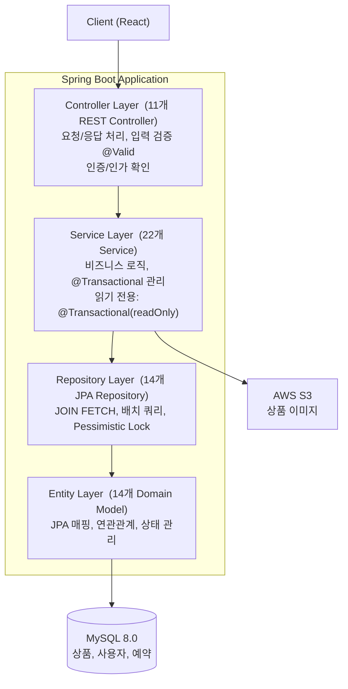
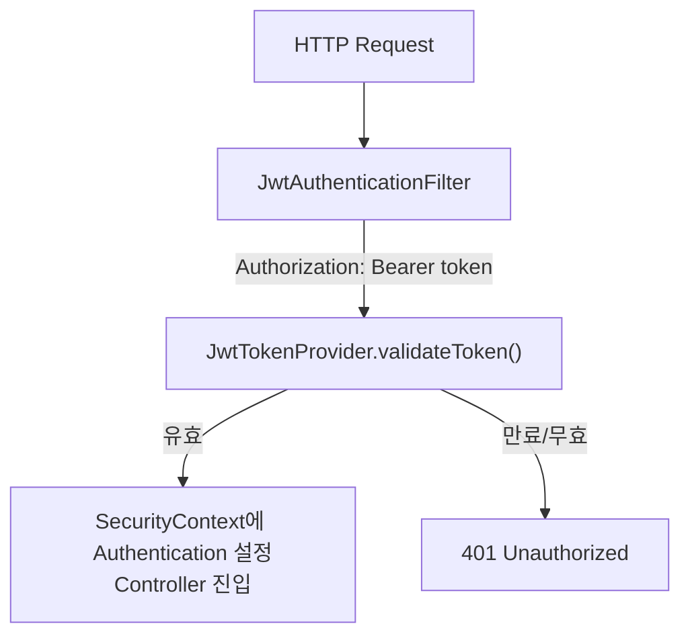
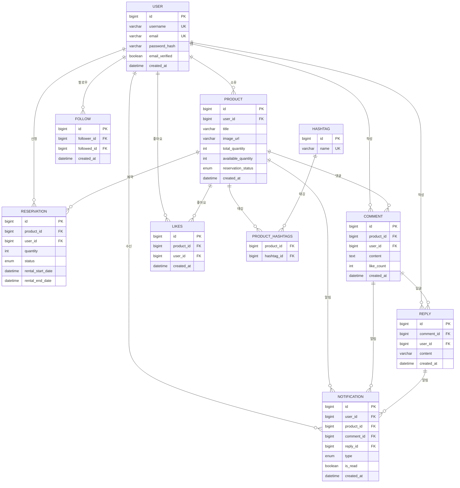

# BorrowMe

물건 대여 플랫폼 — 상품 등록, 예약, 팔로우, 댓글, 랭킹, 알림까지 갖춘 Spring Boot REST API


---

## 아키텍처

### 레이어드 아키텍처



### JWT 인증 흐름



### 주요 엔티티 관계



---

## 주요 기능

| 기능 | 설명 | API |
|------|------|-----|
| **상품 관리** | CRUD + S3 이미지 업로드 + 해시태그 태깅 | `POST/GET/PUT/DELETE /api/products` |
| **예약 시스템** | 수량 기반 예약/취소 + Pessimistic Lock 재고 관리 | `POST /api/products/{id}/reserve` |
| **JWT 인증** | Stateless 인증, 토큰 갱신, BCrypt 암호화 | `POST /api/auth/login`, `/register` |
| **소셜 기능** | 팔로우/언팔로우, 좋아요, 댓글, 답글 | `/api/follows`, `/api/likes`, `/api/comments` |
| **랭킹** | 팔로워 수 기반 Top 10 사용자 + 최근 상품 | `GET /ranking` |
| **검색** | 상품명/설명/사용자명 + 운동/해시태그 통합 검색 | `GET /api/search` |
| **알림** | 댓글/답글/팔로우 실시간 알림 + 읽음 처리 | `/api/notifications` |
| **이메일 인증** | 회원가입 시 이메일 인증 코드 발송 | Gmail SMTP |

---

## 트러블슈팅

### 1. N+1 쿼리 → JOIN FETCH + 배치 쿼리

**문제** — 상품 목록 조회 시 상품 N개마다 User, Hashtag, Follow 쿼리가 개별 실행되어 총 `1 + N + N`회 쿼리 발생

```java
// Before: 상품마다 개별 팔로우 조회
List<Product> products = productService.getAllProducts();
products.stream().map(product -> {
    boolean isFollowed = followService.isFollowing(currentUser, product.getUser()); // N번
    return convertToResponse(product, isFollowed);
});
```

**원인** — Lazy Loading 기본 전략에서 연관 엔티티(User, Hashtag)를 접근할 때마다 개별 SELECT 발생. 팔로우 상태도 건건이 조회

**해결** — JOIN FETCH로 연관 데이터를 한 번에 조회, 팔로우 상태를 배치 쿼리로 사전 로딩

```java
// After: JOIN FETCH + 배치 쿼리 → 총 3회 쿼리
List<Product> products = productService.getAllProductsWithDetails(); // JOIN FETCH 1회

Set<Long> followedUserIds = followService.getFollowedUserIds(
    currentUser, owners);                                           // 배치 쿼리 1회

products.stream().map(product ->
    convertToProductResponse(product, followedUserIds));             // Set.contains() O(1)
```

```java
// Repository
@Query("SELECT DISTINCT p FROM Product p LEFT JOIN FETCH p.user LEFT JOIN FETCH p.hashtags")
List<Product> findAllWithUserAndHashtags();

List<Follow> findByFollowerAndFollowedIn(User follower, List<User> followed);
```

**결과** — 상품 100개 기준 `201회 → 3회` 쿼리 감소

| 지표 (30 VU, 30초) | Before (N+1) | After (JOIN FETCH) | 개선 |
|---|---|---|---|
| p95 응답시간 | 1,010ms | 23ms | **44배 감소** |
| 처리량 | 30 req/s | 253 req/s | **8.4배 증가** |
| 30초간 처리 건수 | 938회 | 7,663회 | |

---

### 2. 동시 예약 Race Condition → Pessimistic Lock

**문제** — 여러 사용자가 동시에 같은 상품을 예약하면 재고가 음수로 내려가는 Race Condition 발생

```
트랜잭션 A:  READ(재고=1)  ──────────  UPDATE(재고=0)  COMMIT
트랜잭션 B:       READ(재고=1)  ──  UPDATE(재고=0)  COMMIT
→ 재고 1개인 상품에 2건 예약 성공 (데이터 불일치)
```

**원인** — 두 트랜잭션이 동시에 같은 행을 읽으면 둘 다 "재고 충분"으로 판단하여 중복 차감

**해결** — `@Lock(PESSIMISTIC_WRITE)`로 행 레벨 잠금(`SELECT FOR UPDATE`) 적용

```java
@Lock(LockModeType.PESSIMISTIC_WRITE)
@Query("SELECT p FROM Product p WHERE p.id = :id")
Optional<Product> findByIdForUpdate(Long id);
```

```
트랜잭션 A:  LOCK ── READ(재고=1) ── UPDATE(재고=0) ── COMMIT ── UNLOCK
트랜잭션 B:         (대기)                                 LOCK ── READ(재고=0) ── 예외
→ 정확히 1건만 예약 성공
```

**결과** — k6 동시 예약 테스트(100 VU, 재고 50개): **성공 50건 + 실패 50건, 초과 예약 0건, p95 233ms**

---

### 3. Hibernate L1 캐시가 Pessimistic Lock 무력화 → entityManager.detach()

**문제** — k6 부하 테스트(100명 동시 예약)로 2번 해결책을 검증하던 중, `SELECT FOR UPDATE`가 실제로 실행되지 않아 **100건 전부 성공**하는 현상 발견

**원인** — Spring Boot의 OSIV(`open-in-view=true`)가 기본 활성화되어 Controller ~ Service가 같은 Hibernate Session을 공유. Controller에서 `getProductById()`로 이미 로딩된 Product가 L1 캐시에 존재하므로, Service의 `findByIdForUpdate()` 호출 시 **DB를 조회하지 않고 캐시된 엔티티를 반환** → `FOR UPDATE` 잠금이 걸리지 않음

```java
// Before: L1 캐시로 인해 FOR UPDATE 무시
@Transactional
public Reservation reserve(Product product, User user, int quantity) {
    Product lockedProduct = productRepository.findByIdForUpdate(product.getId()); // 캐시 반환
    // ...
}
```

**해결** — `entityManager.detach()`로 L1 캐시에서 엔티티를 제거한 뒤 `findByIdForUpdate()` 호출

```java
// After: detach로 캐시 제거 → FOR UPDATE 정상 실행
@Transactional
public Reservation reserve(Product product, User user, int quantity) {
    entityManager.detach(product);

    Product lockedProduct = productRepository.findByIdForUpdate(product.getId())
            .orElseThrow(() -> new IllegalArgumentException("상품을 찾을 수 없습니다."));

    if (lockedProduct.getAvailableQuantity() < quantity) {
        throw new IllegalStateException("재고가 부족합니다.");
    }
    lockedProduct.setAvailableQuantity(lockedProduct.getAvailableQuantity() - quantity);
    // ...
}
```

**결과** — k6 동시 예약 테스트 (100 VU, 재고 50개)

| 지표 | Before (detach 없음) | After (detach 적용) |
|---|---|---|
| 예약 성공 | 100건 (전부 성공) | 50건 |
| 예약 실패 | 0건 | 50건 |
| 최종 재고 | 불일치 (음수) | **0 (정합성 100%)** |

---

### 4. 해시태그 Upsert N+1 → 배치 패턴

**문제** — 해시태그 N개를 저장할 때 각각 `findByName` + `save`로 **2N회** 쿼리 실행

```java
// Before: 개별 조회 + 개별 저장 → 2N 쿼리
for (String name : hashtagNames) {
    Hashtag hashtag = hashtagRepository.findByName(name)     // N번
            .orElseGet(() -> hashtagRepository.save(new...)); // N번
    result.add(hashtag);
}
```

**원인** — 루프 내에서 단건 조회/저장을 반복하는 패턴

**해결** — `findByNameIn`으로 일괄 조회, 누락분만 `saveAll`로 일괄 저장

```java
// After: 배치 조회 + 배치 저장 → 최대 2 쿼리
List<Hashtag> existing = hashtagRepository.findByNameIn(hashtagNames);
Map<String, Hashtag> map = existing.stream()
        .collect(Collectors.toMap(Hashtag::getName, h -> h));

List<Hashtag> newTags = hashtagNames.stream()
        .filter(name -> !map.containsKey(name))
        .map(name -> { Hashtag h = new Hashtag(); h.setName(name); return h; })
        .toList();

if (!newTags.isEmpty()) hashtagRepository.saveAll(newTags);
```

**결과** — 해시태그 수와 무관하게 **최대 2회** 쿼리로 고정

---

### 5. 민감 정보 노출 → @JsonIgnore + 환경변수 분리

**문제** — User 엔티티가 연관 관계를 통해 API 응답에 포함될 때 `passwordHash`, `verificationToken`이 직렬화되어 노출

```json
// Before
{ "user": { "username": "john", "passwordHash": "$2a$10$...", "verificationToken": "abc123..." } }
```

**해결** — `@JsonIgnore`로 민감 필드 제외, 비밀키를 환경변수로 분리, git 이력에서 제거

```java
// After
@JsonIgnoreProperties({"products", "comments", "likes", "following", "followers"})
public class User {
    @JsonIgnore private String passwordHash;
    @JsonIgnore private String verificationToken;
}
```

**결과** — API 응답에서 민감 정보 완전 제거. `git filter-repo`로 이력 정리, GitHub Push Protection 적용

---

### k6 부하 테스트 Before/After 비교

| 테스트 | 지표 | Before | After | 개선 |
|--------|------|--------|-------|------|
| **상품 목록 조회** (30 VU, 30초) | p95 응답시간 | 1,010ms | 23ms | 44배 감소 |
| | 처리량 | 30 req/s | 253 req/s | 8.4배 증가 |
| **동시 예약** (100 VU, 재고 50개) | 예약 성공 | 100건 (전부 성공) | 50건 | |
| | 재고 정합성 | 불일치 | **정합성 100%** | |
| **검색** (30 VU, 30초) | p95 응답시간 | - | 72ms | 에러율 0% |
| | 처리량 | - | 223 req/s | 6,754회 처리 |

---

## 프로젝트 구조

```
src/main/java/com/ardkyer/borrowme/
├── controller/          # REST API 엔드포인트 (11개)
│   ├── ProductController        - 상품 CRUD + 예약
│   ├── UserController           - 회원가입, 로그인
│   ├── FollowController         - 팔로우/언팔로우
│   ├── CommentController        - 댓글 CRUD
│   ├── ReplyController          - 답글
│   ├── LikeController           - 좋아요
│   ├── NotificationController   - 알림
│   ├── SearchController         - 검색
│   ├── RankingController        - 랭킹
│   └── ...
├── service/             # 비즈니스 로직 (22개)
├── repository/          # 데이터 접근 (14개)
├── entity/              # 도메인 모델 (14개)
│   ├── User, Product, Reservation, Comment, Reply
│   ├── Follow, Like, CommentLike, Hashtag
│   ├── Notification, Exercise
│   └── EmailVerification, RecentSearch
├── config/              # 설정 (7개)
│   ├── SecurityConfig           - Spring Security + JWT
│   ├── GlobalExceptionHandler   - 전역 예외 처리
│   ├── EmailConfig              - Gmail SMTP
│   ├── S3Config                 - AWS S3
│   └── OpenApiConfig            - Swagger
├── security/            # JWT 인증 (3개)
│   ├── JwtTokenProvider         - 토큰 생성/검증
│   ├── JwtAuthenticationFilter  - 요청 필터
│   └── PrincipalDetails         - 사용자 인증 정보
└── dto/                 # 요청/응답 DTO
    ├── request/         - LoginRequest, SignupRequest (Bean Validation)
    └── response/        - UserResponse, LoginResponse, ProductResponse
```

---

## 기술 스택

| 분류 | 기술 |
|------|------|
| **Backend** | Spring Boot 3.1.5, Java 17 |
| **Database** | MySQL 8.0 (운영), Testcontainers MySQL (통합 테스트) |
| **ORM** | Spring Data JPA, Hibernate |
| **Security** | Spring Security 6, JWT (jjwt 0.11.5), BCrypt |
| **Storage** | AWS S3 (Spring Cloud AWS) |
| **Email** | Spring Mail (Gmail SMTP) |
| **Documentation** | SpringDoc OpenAPI 3 (Swagger UI) |
| **Validation** | Jakarta Bean Validation |
| **Build** | Gradle |
| **Test** | JUnit 5, Testcontainers MySQL, MockMvc |
| **Load Test** | k6 (동시성 검증, 부하 테스트) |

---

## 실행 방법

### 환경변수 설정

```bash
export DB_PASSWORD=your_db_password
export JWT_SECRET=your_jwt_secret_key_minimum_256_bits
export AWS_ACCESS_KEY_ID=your_aws_access_key
export AWS_SECRET_ACCESS_KEY=your_aws_secret_key
export MAIL_USERNAME=your_email@gmail.com
export MAIL_PASSWORD=your_app_password
```

### 빌드 및 실행

```bash
# 빌드
./gradlew build

# 실행 (local 프로필)
./gradlew bootRun --args='--spring.profiles.active=local'

# 테스트 (Testcontainers MySQL — Docker 필요)
./gradlew test
```

### API 문서

서버 실행 후 Swagger UI에서 전체 API 확인:

```
http://localhost:5000/swagger-ui/index.html
```
