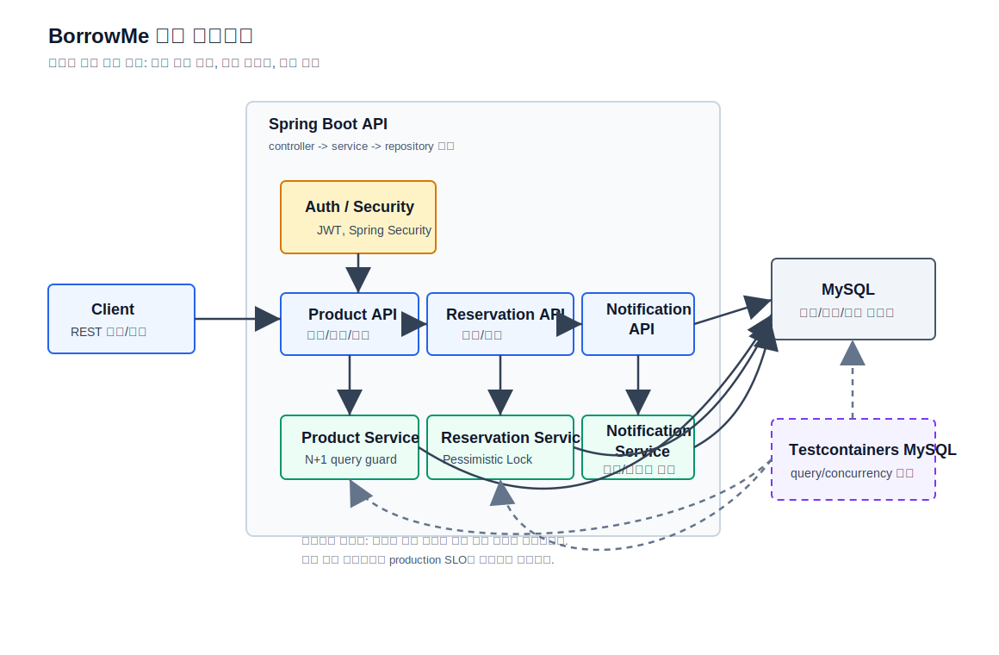

# BorrowMe


BorrowMe는 **가톨릭대학교 GGUM 해커톤에서 시작한 11인 팀 프로젝트**입니다.
대학생 간 물건 대여 흐름을 다루는 Spring Boot REST API이며,
이 README는 백엔드 포트폴리오 관점에서 **예약 정합성, 상품 목록 조회 성능,
알림 흐름, 테스트 근거**를 빠르게 확인할 수 있도록 요약합니다.

## 30초 요약

| 구분 | 내용 |
| --- | --- |
| 프로젝트 | 대학생 간 유휴 물건을 빌려주고 빌릴 수 있는 물건 대여 플랫폼 |
| 백엔드 주제 | 수량 기반 예약, Pessimistic Lock 동시성 제어, 상품 목록 N+1 개선, 알림, k6 성능 테스트 |
| 핵심 문제 | 동시에 예약해도 재고가 깨지지 않아야 하고, 목록/검색 API에서 불필요한 반복 쿼리를 줄여야 함 |
| 현재 검증 | Testcontainers query-count/concurrency guard와 local k6 snapshot artifact 보존 |
| 주의 | 운영 성능 claim이 아니라 로컬 재실행 snapshot과 원본 README historical record를 분리해 설명 |

## 전체 아키텍처



이 다이어그램은 후보자 담당 범위 중심으로 상품 목록 조회, 예약 정합성, 알림 흐름과
Testcontainers MySQL 검증 경계를 단순화해 보여줍니다. 상세 설명은
[`docs/ARCHITECTURE.md`](docs/ARCHITECTURE.md)에 정리했습니다.

| 핵심 설계 판단 | 이유 | 검증/주장 경계 |
| --- | --- | --- |
| Product / Reservation / Notification 흐름 분리 | 목록 조회, 재고 차감, 알림 처리를 면접에서 독립적으로 설명하기 위함 | 구현된 API/service 흐름 기준 |
| Reservation Service에서 Pessimistic Lock 사용 | 동시 예약 시 재고가 음수가 되지 않는 정합성이 우선 | Testcontainers 동시 예약 시나리오 검증 |
| Product Service 조회 경로에 query-count guard 유지 | 상품 목록 N+1 회귀를 자동 테스트로 감시 | 현재 guard와 local k6 snapshot 범위 |
| Testcontainers MySQL로 핵심 검증 수행 | MySQL 기준 query/concurrency 동작을 확인 | 운영 배포 토폴로지나 production SLO 주장 아님 |

이 다이어그램은 구현된 핵심 흐름과 검증 대상 경계를 설명하기 위한 단순화된 구조도이며, 운영 배포 토폴로지나 production SLO를 주장하지 않습니다.

## 현재 clean repeat3 local snapshot

2026-05-23에 clean commit 기준으로 `product-listing` k6 시나리오를 재실행하고
raw artifact를 보존했습니다. 이 값은 현재 README에서 말할 수 있는
**현재 local snapshot**입니다.

| 항목 | 값 |
| --- | --- |
| 시나리오 | `product-listing`, 30 VU, 30초 |
| 실행 환경 | local app `localhost:5001`, throwaway Docker MySQL `shop:3307`, `k6/setup-data.sql` fixture |
| p50 | 121.6ms |
| p95 | 358.1088ms |
| p99 | 557.66ms |
| HTTP 실패율 | 0.00% |
| checks | 10,683 / 10,683 성공 |
| raw artifact | [`docs/evidence/k6/20260523T004642Z-product-listing/`][product-listing-repeat3] |

## 원본 README 기록

아래 값은 원본 README에 남아 있던 historical record입니다.
상품 목록 p95 `23ms`는 raw k6 artifact가 없으므로
**현재 측정 완료 수치로 주장하지 않습니다**.
현재 clean repeat3 snapshot인 p95 `358.1088ms`와 같은 조건의 재현값으로 비교하지 않습니다.

| 항목 | Before | After | 해석 |
| --- | --- | --- | --- |
| 상품 목록 p95 | 1,010ms | 23ms | 원본 README 기록, raw artifact 없음, 현재 measured claim 아님 |
| 상품 목록 처리량 | 30 req/s | 253 req/s | 원본 README 기록, raw artifact 없음, 현재 measured claim 아님 |
| 상품 목록 DB 쿼리 | 201회 | 3회 | 원본 README 기록 + 현재 query-count guard로 회귀 방지 |
| 검색 p95 | - | 72ms | 원본 README 기록, raw artifact 없음, 현재 measured claim 아님 |

## 팀 구성과 본인 담당

| 구분 | 내용 |
| --- | --- |
| 이벤트 | 가톨릭대학교 GGUM 해커톤, 1박 2일, 2024 |
| 팀 구성 | 11명: PM 2명, 디자이너 1명, 프론트엔드 2명, 백엔드 6명 |
| 본인 담당 | 예약 시스템, Pessimistic Lock 기반 동시성 제어, N+1 개선, k6 성능 테스트, 알림 시스템 |

## 이 레포가 증명하는 것
### 측정 완료

- 상품 목록 clean repeat3:
  p95 358.1088ms, HTTP 실패율 0.00%, checks 10,683 / 10,683 성공
- 근거:
  [`docs/evidence/k6/20260523T004642Z-product-listing/`][product-listing-repeat3]

### 원본 README 기록

- 상품 목록 p95 1,010ms -> 23ms
- 처리량 30 req/s -> 253 req/s
- raw k6 artifact가 없어 현재 측정 claim으로 사용하지 않습니다.

### 시나리오 검증

- 재고 50개 상품에 100명 동시 예약:
  성공 50건, 최종 재고 0, 재고 부족 실패 시 row·재고 불변
- 인증 `GET /api/products`:
  팔로우 여부 true/false 응답과 SQL 5회 이하 query-count guard
- ranking data path:
  상위 사용자, 최근 상품, 팔로우 여부 조합을 SQL 5회 이하로 유지
- `GET /ranking` handler/model assembly:
  topUsers/currentUser/recentProducts/followed flag 구성과 SQL 6회 이하 guard
- Flyway baseline schema migration과 migration history 생성

관련 문서는 [`docs/RESERVATION_CONSISTENCY.md`](docs/RESERVATION_CONSISTENCY.md),
[`docs/MIGRATION_STRATEGY.md`](docs/MIGRATION_STRATEGY.md),
[`docs/LIMITATIONS.md`](docs/LIMITATIONS.md)에 분리했습니다.

README는 핵심 요약만 담고, 상세한 판단 근거와 한계는 `docs/`에 둡니다.

## 주요 기능

- JWT 기반 회원가입, 로그인, 토큰 인증
- 상품 CRUD, 이미지 업로드, 해시태그 추출/검색
- 수량 기반 상품 예약과 예약 취소
- 팔로우, 좋아요, 댓글, 답글
- 상품명, 설명, 사용자명, 운동/해시태그 기반 검색
- 최근 검색어 관리
- 팔로워 기반 랭킹
- 댓글/답글/팔로우 알림과 읽음 처리
- Gmail SMTP 이메일 인증
- Swagger OpenAPI 문서

## 기술 스택

| 영역 | 기술 |
| --- | --- |
| Backend | Java 17, Spring Boot 3.1.5, Spring Web, Validation |
| Security | Spring Security, JWT, BCrypt |
| Persistence | Spring Data JPA, MySQL, H2 for lightweight tests, MySQL Testcontainers for evidence tests |
| Storage / Mail | AWS S3, Spring Mail |
| Docs / Test | springdoc-openapi, JUnit 5, Testcontainers, k6 |
| Build | Gradle |

[product-listing-repeat3]: docs/evidence/k6/20260523T004642Z-product-listing/

## 구조

```text
src/main/java/com/ardkyer/borrowme/
├── config/       # Security, JWT, S3, Email, OpenAPI, 예외 처리
├── controller/   # 상품, 회원, 검색, 댓글, 알림, 팔로우 등 API
├── dto/          # 인증/회원 요청과 응답 DTO
├── entity/       # User, Product, Reservation, Comment, Follow 등
├── repository/   # JPA Repository
├── security/     # JWT 필터와 PrincipalDetails
└── service/      # 도메인 서비스
```

## 실행 방법

로컬 프로필은 MySQL `shop` 데이터베이스를 사용합니다.

```bash
./gradlew bootRun --args='--spring.profiles.active=local'
```

로컬 실행에 필요한 대표 환경 변수는 다음과 같습니다.

| 변수 | 용도 |
| --- | --- |
| `DB_USERNAME`, `DB_PASSWORD` | MySQL 접속 정보 |
| `JWT_SECRET` | JWT 서명 키 |
| `AWS_ACCESS_KEY_ID`, `AWS_SECRET_ACCESS_KEY` | S3 업로드 |
| `MAIL_USERNAME`, `MAIL_PASSWORD` | Gmail SMTP |

테스트는 Java 17에서 Gradle로 실행합니다.

```bash
JAVA_HOME=$(/usr/libexec/java_home -v 17) ./gradlew test
```

## 성능 테스트

`k6/`에는 상품 목록, 검색, 동시 예약 시나리오가 정리되어 있습니다.

```bash
BASE_URL=http://localhost:5000 k6 run k6/test-product-listing.js
BASE_URL=http://localhost:5000 k6 run k6/test-search.js
BASE_URL=http://localhost:5000 k6 run k6/test-concurrent-reserve.js
```

반복 측정 결과를 보존하려면 wrapper를 사용합니다.

```bash
BASE_URL=http://localhost:5000 k6/run-with-evidence.sh product-listing
BASE_URL=http://localhost:5000 k6/run-with-evidence.sh search
BASE_URL=http://localhost:5000 k6/run-with-evidence.sh concurrent-reserve
```

## 문서

| 문서 | 내용 |
| --- | --- |
| [`docs/DESIGN.md`](docs/DESIGN.md) | 예약 정합성, 상품 목록 조회 경로, 팀 프로젝트 주장 경계 |
| [`docs/ARCHITECTURE.md`](docs/ARCHITECTURE.md) | 전체 아키텍처 다이어그램과 상품/예약/알림 검증 경계 |
| [`docs/PERF_RESULT.md`](docs/PERF_RESULT.md) | 원본 README 수치와 현재 local snapshot 해석 기준 |
| [`docs/PRODUCT_LIST_PERF.md`](docs/PRODUCT_LIST_PERF.md) | 상품 목록 조회 N+1 개선과 p95/처리량/쿼리 수 기록 |
| [`docs/RESERVATION_CONSISTENCY.md`](docs/RESERVATION_CONSISTENCY.md) | 재고 50개 / 100 VU 동시 예약 정합성 개선 |
| [`docs/TESTING.md`](docs/TESTING.md) | Product 목록/검색 query guard와 reservation concurrency 검증 범위 |
| [`docs/TEAM_CONTRIBUTION.md`](docs/TEAM_CONTRIBUTION.md) | 11인 팀 프로젝트에서 본인 담당 범위와 포트폴리오 주장 경계 |
| [`docs/MIGRATION_STRATEGY.md`](docs/MIGRATION_STRATEGY.md) | Flyway baseline validation과 migration 주장 범위 |
| [`docs/RUNBOOK.md`](docs/RUNBOOK.md) | 상품 목록 성능 회귀, 예약 재고 불일치, 검색 성능 claim 확인 절차 |
| [`docs/LIMITATIONS.md`](docs/LIMITATIONS.md) | query-count 자동 회귀 테스트, Flyway, 운영 성능 claim의 한계 |
| [`docs/INTERVIEW_GUIDE.md`](docs/INTERVIEW_GUIDE.md) | 면접에서 설명할 핵심 질문과 안전한 답변 |

## 참고 사항

- 이 저장소는 백엔드 API 중심이며 프론트엔드 코드는 포함하지 않습니다.
- `application-prod.properties`는 `DB_URL`, `DB_USERNAME`, `DB_PASSWORD`, `PORT`를 외부에서 주입하는 배포용 설정입니다.
- 새 성능 수치를 주장하려면 k6 실행 로그, summary, dataset 조건, git 상태를 함께 보존한 뒤 문서를 갱신합니다.
